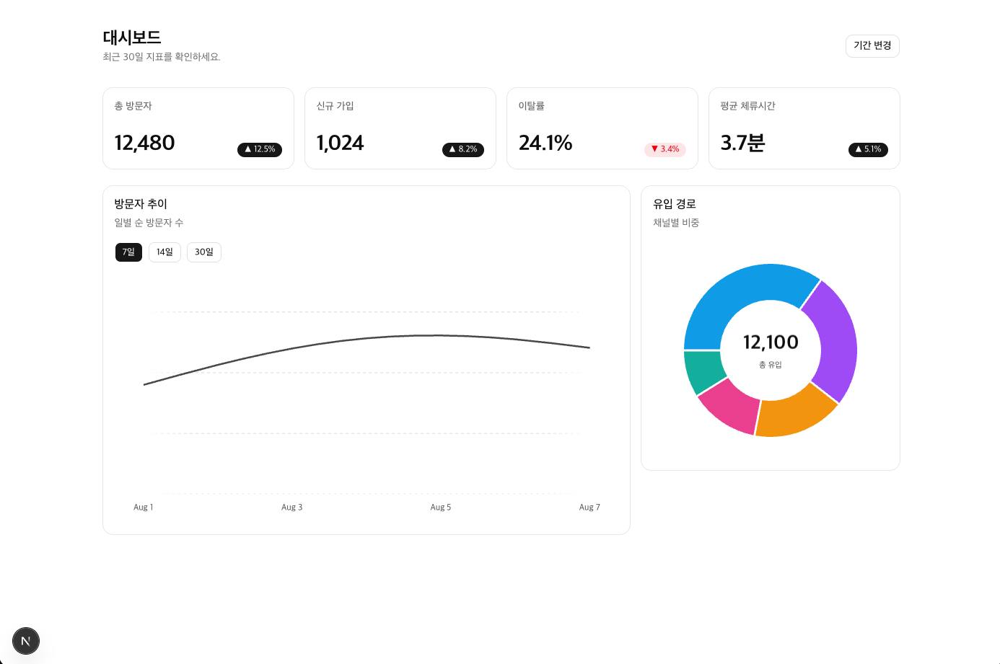

# anime-dashboard

Next.js 16 + shadcn/ui + Bklit UI + Anime.js로 만든 애니메이션 대시보드 실습 프로젝트.



## 왜 이 조합인가

| 기술                    | 역할       | 선택 이유                                                                    |
| ----------------------- | ---------- | ---------------------------------------------------------------------------- |
| Next.js 16 (App Router) | 프레임워크 | 서버/클라이언트 컴포넌트 경계를 직접 다뤄보기 위해                           |
| shadcn/ui               | 기본 UI    | 소스를 프로젝트에 복사하는 registry 방식이라 내부 구현을 읽고 수정할 수 있음 |
| Bklit UI                | 차트       | shadcn registry 위에 얹히는 합성형 차트 API, 데이터 전환 트위닝 내장         |
| Anime.js v4             | 애니메이션 | 명령형 제어(카운트업, 등장 연출)에 적합                                      |

## 실행

```bash
pnpm install
pnpm dev
```

Node 20 이상 필요 (개발 환경: Node 22.23.2, pnpm 11).

## 구현한 것

- **KPI 카드** — Anime.js로 0부터 목표값까지 카운트업 (`outExpo` 이징, 천 단위 구분, 소수점 자릿수 지원)
- **순차 등장** — 카드마다 `delay`를 어긋나게 줘서 스태거 효과
- **라인 차트** — Bklit `LineChart`, 크로스헤어 툴팁, 7/14/30일 전환 시 y축 도메인 트위닝
- **도넛 차트** — 채널별 유입 비중, 중앙 합계 표시
- **스크롤 등장** — `IntersectionObserver` + Anime.js로 뷰포트 진입 시 재생

## 트러블슈팅

### 1. Bklit registry의 상대경로 import 깨짐

설치 직후 `Module not found: Can't resolve '../components/shimmering-text'`.

원인은 Bklit 모노레포 구조(`charts/`와 `components/`가 형제) 기준 경로가 그대로 복사된 것. 내 프로젝트에선 `components/components/`라는 없는 경로를 가리켰다.

```bash
grep -rl '"\.\./components/' components/charts \
  | xargs sed -i '' 's#"\.\./components/#"@/components/#g'
```

### 2. 라인 차트가 렌더는 되는데 선이 안 보임

파이 차트는 정상이고 라인만 안 보이는 상황. 소스에서 기본값을 확인:

```ts
// components/charts/line.tsx
stroke = chartCssVars.linePrimary; // → var(--chart-line-primary)
```

`globals.css`를 grep해보니 대시가 4개인 오타가 있었다.

```css
--chart-line-primary: var(----chart-line-primary); /* ❌ 정의되지 않은 변수 */
```

이 줄이 `:root`의 정상 정의(`var(--chart-1)`)를 덮어써서 stroke가 무효값이 되고, 선이 투명하게 그려지고 있었다. 파이 차트는 데이터에 색을 직접 넣어서 영향이 없었던 것.

### 3. hydration 불일치 두 종류

- **차트**: 컨테이너 크기를 측정하는 컴포넌트라 서버 렌더 결과와 불일치 → `ClientOnly` 래퍼로 마운트 후 렌더
- **`<html>` 속성**: 브라우저 확장이 주입한 `data-hwp-extension` → `suppressHydrationWarning`

원인이 다르므로 대응도 달라야 한다. 확장 프로그램 케이스에 `ClientOnly`를 쓰거나, 차트 케이스에 `suppressHydrationWarning`을 쓰면 둘 다 틀린 처방.

### 4. 차트 영역이 0px

DOM 검사에서 `<div style="width:100%;height:100%"></div>`가 비어 있는 것을 확인. 레이아웃 작업 때 쓴 플레이스홀더 `div`(`flex items-center justify-center h-[300px]`)가 남아 있어서, 안쪽 차트가 너비를 0으로 측정하고 있었다.

콘솔에는 아무 에러도 없었고 Elements 탭에만 증거가 있었다.

### 5. dev는 통과, build는 실패

`pnpm dev`(Turbopack)는 타입 검사를 하지 않는다. `pnpm build`에서만 드러난 것:

- `@types/d3-shape`, `@types/d3-array` 누락 (Bklit이 devDependencies에 안 넣음)
- `useEffect` cleanup에서 `return () => anim.pause()` — `pause()`의 반환값이 그대로 리턴되어 `Destructor` 타입 위반. 중괄호로 감싸 해결

## 배운 것

- shadcn registry 방식의 트레이드오프: 배포자의 버그도 그대로 복사되지만, **소스가 내 프로젝트에 있으니 직접 고칠 수 있다**
- 레이아웃 문제는 콘솔이 아니라 Elements 탭에 답이 있다
- 애니메이션 역할 분담 — 명령형(Anime.js: 카운트업, 등장) / 선언형(Bklit 내장: 데이터 전환)
- 커밋 전 `pnpm build`는 필수. dev 서버는 타입 에러를 알려주지 않는다

## 남은 과제

- [ ] `next-themes` 다크모드 (토큰 기반이라 차트까지 자동 대응 예상)
- [ ] Route Handler로 실제 데이터 연결
